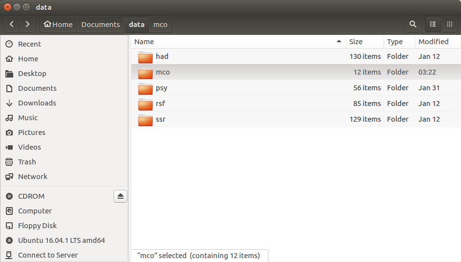

# Les archives PMSI {#archives}

Cette partie aborde le point de départ des études PMSI : les archives PMSI. Ces archives sont les fichiers en entrées / sorties des logiciels de l'ATIH.

Les manuels techniques de ces logiciels, relatifs aux champs MCO, SSR, HAD, PSY et RSF, respectivement [Genrsa](http://atih.sante.fr/plateformes-de-transmission-et-logiciels/logiciels-espace-de-telechargement#G), [Genrha](http://atih.sante.fr/plateformes-de-transmission-et-logiciels/logiciels-espace-de-telechargement#G), [Paprica](http://atih.sante.fr/plateformes-de-transmission-et-logiciels/logiciels-espace-de-telechargement#P), [Pivoine](http://atih.sante.fr/plateformes-de-transmission-et-logiciels/logiciels-espace-de-telechargement#P) et [Preface](http://atih.sante.fr/plateformes-de-transmission-et-logiciels/logiciels-espace-de-telechargement#P) sont disponibles dans l'[espace de téléchargement](http://atih.sante.fr/plateformes-de-transmission-et-logiciels/logiciels-espace-de-telechargement) sur le site de l'ATIH.


## Arborescence des archives

Le package *pmeasyr* prend en charge les données des quatre champs PMSI MCO, SSR, HAD, PSY ainsi que les RSF.

Placer les archives dans un répertoire, par exemple ici dans `~/Documents/data/mco` :


Vous noterez que pour chaque champ PMSI il est conseillé d'utiliser un répertoire indépendant, ceci est nécessaire dans la mesure où le nom des archives PMSI ne contient pas l'information champ MCO, RSF, etc., il faut organiser l'archivage champ par champ, dans des répertoires différents.





```{r eval = F}
# Créer l'arborescence à partir de R
champs = c('mco', 'ssr', 'had', 'psy', 'rsf')
emplacement <- "~/Documents/data"
sapply(champs, function(x){dir.create(file.path(emplacement, x))})
```


### Sous Unix

Chaque utilisateur dispose de son path '~', qui équivaut par exemple à : '/home/gui/'.

### Sous Windows

Chaque utilisateur dispose de son répertoire, exemple `C:/Users/gui/`. Et souvent, sans l’utilisation de projets RStudio, les chemins d’accès aux données sont pénibles à configurer dans chaque programme.

Mais dans R, le symbole '~' utilisé sur windows dans un chemin d’accès aux fichiers renvoie au répertoire Documents de l’utilisateur : `C:/Users/gui/Documents`.

```{r eval = F}
path.expand('~')
```

renvoie `C:/Users/gui/Documents/`.

Par conséquent sur Windows le répertoire à créer pour localiser les fichiers d’archives pmsi sera : `C:/Users/gui/Documents/Documents/data`.

**N.B.: Nous proposons ici que les utilisateurs de `pmeasyr` utilisent ce chemin générique pour leurs programmes. L'avantage qui en découle : le partage de programme ne nécessite pas de changer le chemin d'accès, puisque c'est le même.**

## Informations sur les archives

Le nom des fonctions dont l'objectif est de manipuler les **a**rchives commence par **a**.

La fonction `astat` permet d'éditer des statistiques sommaires sur les fichiers contenus dans une archive.

|Nom       |Fonction                                                                               |
|:---------|:--------------------------------------------------------------------------------------|
|[astat](https://im-aphp.github.io/pmeasyr/reference/astat.html)     |~ *.zip - Liste et volume des fichiers d'une archive PMSI|


```{r eval = F}
# Informations sur les fichiers : Date de creation, Taille
pmeasyr::astat(path = '~/Documents/data/mco/', 
               file = '750100042.2015.12.29012016174032.out.zip', 
               view = F)
```


## Dézippage

Cette partie du package facilite la manipulation des archives PMSI, fichiers de type :

  - `finess.annee.mois.date_et_heure_de_creation.in.zip`
  - `finess.annee.mois.date_et_heure_de_creation.out.zip`

Les fonctions permettent de dézipper les fichiers depuis `R` en ligne de commande, sans intervention manuelle de l'utilisateur. L'avantage est d'obtenir un processus ne relevant pas d'interventions externes au logiciel `R` (pour pouvoir garder trace des etapes, et faciliter la reproduction, tout est inscrit dans un programme, dans un flux de processus). Une fois que les traitements et analyses sur les fichiers sont faits, il est possible d'effacer les archives également en ligne de commande.


|Nom       |Fonction                                                                               |
|:---------|:--------------------------------------------------------------------------------------|
|[adezip](https://im-aphp.github.io/pmeasyr/reference/adezip.html)    |~ *.zip - Dezippe des fichiers de larchive PMSI                                        |
|[adezip2](https://im-aphp.github.io/pmeasyr/reference/adezip2.html)   |~ *.zip - Dezippe des fichiers de l'archive PMSI, avec en parametre le nom de l'archive|


```{r eval = F}
# Dezippage uniquement des fichiers rsa, ano et tra du out 2015
# Ex: 750100042.2015.12.20160130.153012.out.zip
pmeasyr::adezip(finess = 750100042, 
                annee = 2015, 
                mois = 12, 
                path = '~/Documents/data/mco', 
                liste = c("rsa", "ano", "tra"), 
                type = "out")
```


```{r eval = F}
# Dezippage uniquement des fichiers rss, dmi et med du in 2015
# Ex: 750100042.2015.12.20160130.153012.out.zip
pmeasyr::adezip(finess = 750100042, 
                annee = 2015, 
                mois = 12, 
                path = '~/Documents/data/mco', 
                liste = c("rss", "dmi", "med"), 
                type = "in")
```


## Suppression

À la fin d'une étude, il est inutile de garder les fichiers dézippés hors de l'archive, on peut les effacer : c'est ce que permet la fonction `adelete()`.

```{r eval = F}
# Effacer les fichiers
pmeasyr::adelete(finess = 750100042, 
                 annee = 2015, 
                 mois = 12, 
                 path = '~/Documents/data/mco', 
                 liste = c("rsa", "ano", "tra"), 
                 type = "out")

pmeasyr::adelete(finess = 750100042, 
                 annee = 2015, 
                 mois = 12, 
                 path = '~/Documents/data/mco', 
                 liste = c("rss", "med", "dmi"), 
                 type = "in")
```


